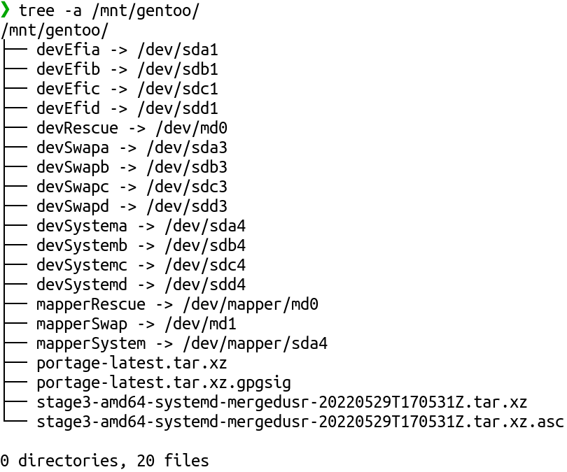
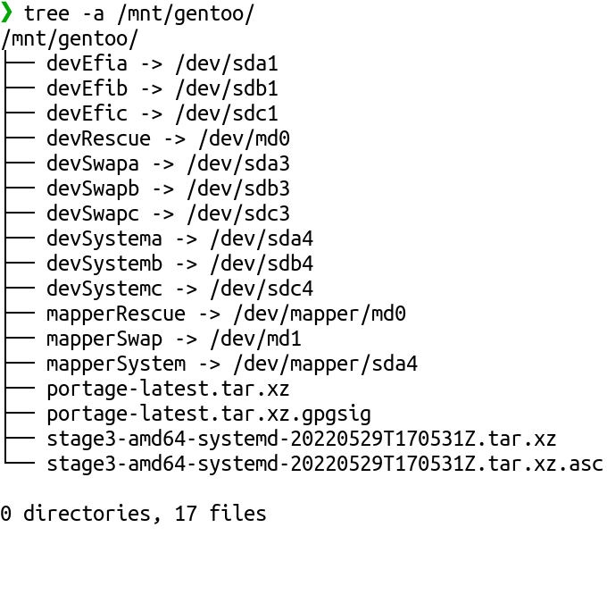
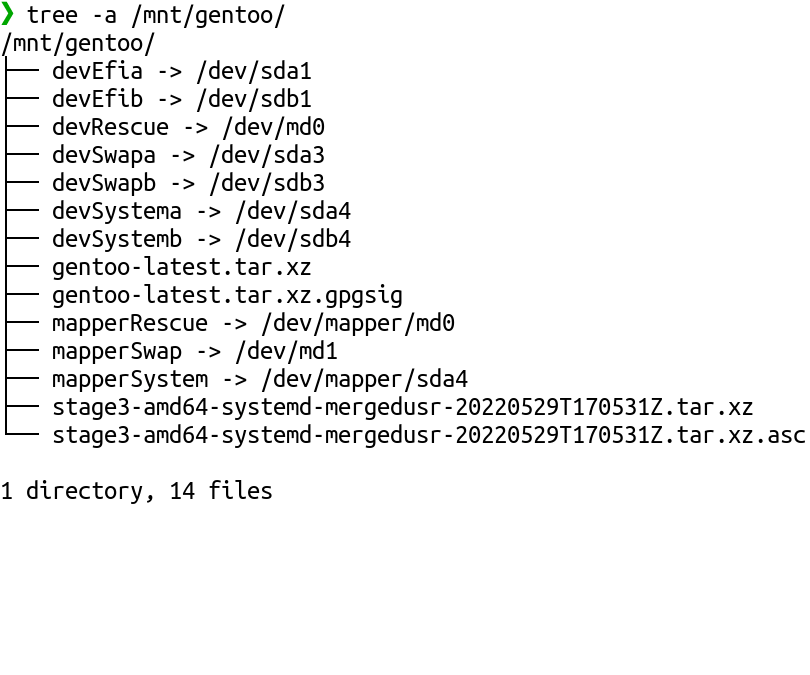
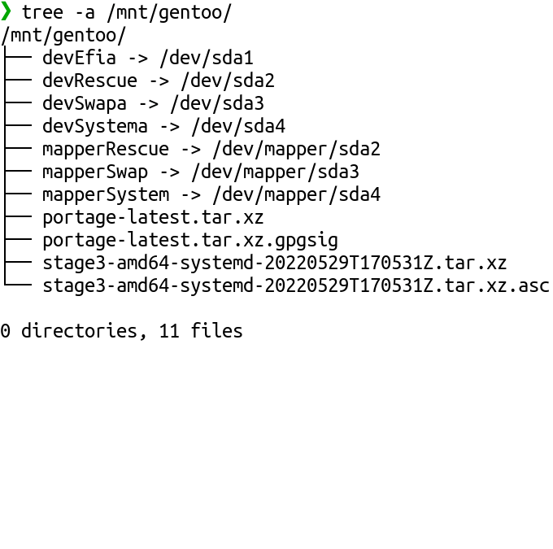

## 3.1. Wiping Disks

[disk.sh](https://github.com/duxsco/gentoo-installation/blob/main/bin/disk.sh) expects the disks, where you want to install Gentoo Linux on, to be completely empty. If that's not the case continue reading. Otherwise, continue with [3.2. Partitioning And Formating](#32-partitioning-and-formating).

If you use SSD(s) I recommend a [Secure Erase](https://wiki.archlinux.org/title/Solid_state_drive/Memory_cell_clearing). Alternatively, you can do a fast wipe the following way given that no LUKS, MDADM, SWAP etc. device is open on the disk (copy&paste one command after the other):

``` { .shell .no-copy }
# Change disk name to the one you want to wipe
disk="/dev/sda"

for i in $(lsblk -npo kname "${disk}" | grep "^${disk}" | sort -r); do
    read -r -p "Do you want to wipe \"$i\"? Type uppercase \"yes\" to confirm. " wipe

    if [[ ${wipe} == YES ]]; then
        wipefs -a "$i"
    fi
done
```

!!! tip
    If you have confidential data stored in a non-encrypted way on HDD(s) and don't want to risk the data landing in foreign hands I recommend the use of something like `dd`, e.g. [https://wiki.archlinux.org/title/Securely_wipe_disk](https://wiki.archlinux.org/title/Securely_wipe_disk)!

## 3.2. Partitioning And Formating

!!! note
    You may want to execute the following codeblock outside `screen` and execute `clear` right after in order for confidential data not to show up when scrolling up.

Prepare the disks (copy&paste one command after the other):

``` { .shell .no-copy }
# list devices
fdisk -l

# lookup all options
bash /tmp/disk.sh -h

# disable bash history
set +o history

# adjust to your liking
bash /tmp/disk.sh -f fallbackfallback -r rescuerescue -d "/dev/sda /dev/sdb etc." -s 12

# enable bash history
set -o history
```

!!! info
    [disk.sh creates the user "meh"](https://github.com/duxsco/gentoo-installation/blob/main/bin/disk.sh#L195) which will be used later on to act as non-root.

## 3.3. /mnt/gentoo Content

After executing "disk.sh", the btrfs subvolume "@root" [mounted by "disk.sh" at "/mnt/gentoo/"](https://github.com/duxsco/gentoo-installation/blob/main/bin/disk.sh#L193) should contain:

=== "four disks"
    

=== "three disks"
    

=== "two disks"
    

=== "single disk"
    

## 3.4. Tarball Extraction

!!! info 
    A recent [stage3-amd64-systemd-mergedusr-*.tar.xz](https://distfiles.gentoo.org/releases/amd64/autobuilds/current-stage3-amd64-systemd-mergedusr/) file was downloaded and verified by [fetch_files.sh](https://github.com/duxsco/gentoo-installation/blob/main/bin/fetch_files.sh) which itself was called by [disk.sh](https://github.com/duxsco/gentoo-installation/blob/main/bin/disk.sh#L198). If you work on another architecture, download and verify the correct stage3 tarball (recommended: `stage3-<architecture>-systemd-mergedusr-<timestamp>.tar.xz` and `stage3-<architecture>-systemd-mergedusr-<timestamp>.tar.xz.asc`) manually and adjust below commands accordingly. Later on, an optional switch to the custom profile [hardened-systemd-merged-usr](https://github.com/duxsco/gentoo-installation/tree/main/overlay/duxsco/profiles/hardened-systemd-merged-usr) and [hardened-systemd-merged-usr-selinux](https://github.com/duxsco/gentoo-installation/tree/main/overlay/duxsco/profiles/hardened-systemd-merged-usr-selinux) both of which making use of [merged-usr](https://www.freedesktop.org/wiki/Software/systemd/TheCaseForTheUsrMerge/) will be done, requiring [modifications of those custom profiles](https://wiki.gentoo.org/wiki/Profile_(Portage)#Creating_custom_profiles) if you use a stage3 tarball other than the ones previously recommended.

[Extract the stage3 tarball](https://wiki.gentoo.org/wiki/Handbook:AMD64/Full/Installation#Unpacking_the_stage_tarball) and copy custom files:

```shell
tar -C /mnt/gentoo/ -xpvf /mnt/gentoo/stage3-*.tar.xz --xattrs-include='*.*' --numeric-owner && \
rsync -a --numeric-ids --chown=0:0 --chmod=u=rwx,go=r /tmp/firewall.nft /mnt/gentoo/usr/local/sbin/ && \
rsync -a /tmp/portage_hook_kernel /mnt/gentoo/root/ && \
mkdir -p /mnt/gentoo/etc/gentoo-installation && \
echo -e "\e[1;32mSUCCESS\e[0m"
```

Extract the portage tarball ([based on archived old handbook](https://web.archive.org/web/20081017141338/http://www.gentoo.org:80/doc/en/handbook/handbook-amd64.xml?full=1#book_part1_chap5__chap3_sect2)):

```shell
mkdir /mnt/gentoo/var/db/repos/gentoo && \
touch /mnt/gentoo/var/db/repos/gentoo/.keep && \
mount -o noatime,subvol=@ebuilds /mnt/gentoo/mapperSystem /mnt/gentoo/var/db/repos/gentoo && \
tar --transform 's#^gentoo-[0-9]\{8\}#gentoo#' -C /mnt/gentoo/var/db/repos/ -xvpJf /mnt/gentoo/gentoo-latest.tar.xz && \
rsync -av --numeric-ids --chown=250:250 /tmp/overlay/duxsco /mnt/gentoo/var/db/repos/ && \
mkdir /mnt/gentoo/etc/portage/repos.conf && \
echo '[duxsco]
location = /var/db/repos/duxsco
auto-sync = false' > /mnt/gentoo/etc/portage/repos.conf/duxsco.conf && \
echo -e "\e[1;32mSUCCESS\e[0m"
```

## 3.5. Mounting

Mount filesystems for the later chroot to work:

```shell
# https://wiki.gentoo.org/wiki/Handbook:AMD64/Full/Installation#Mounting_the_root_partition
mount -t tmpfs -o noatime,nodev,nosuid,mode=1777,uid=root,gid=root tmpfs /mnt/gentoo/tmp && \

# https://wiki.gentoo.org/wiki/Handbook:AMD64/Full/Installation#Mounting_the_necessary_filesystems
mount --types proc /proc /mnt/gentoo/proc && \
mount --rbind /sys /mnt/gentoo/sys && \
mount --make-rslave /mnt/gentoo/sys && \
mount --rbind /dev /mnt/gentoo/dev && \
mount --make-rslave /mnt/gentoo/dev && \
mount --bind /run /mnt/gentoo/run && \
mount --make-slave /mnt/gentoo/run && \

# I put /home, /var/cache/binpkgs, /var/cache/distfiles and /var/tmp
# on separate btrfs subvolumes to keep backups separate.

mount -o noatime,subvol=@home /mnt/gentoo/mapperSystem /mnt/gentoo/home && \

# https://wiki.gentoo.org/wiki//var/cache/binpkgs
# https://wiki.gentoo.org/wiki/Binary_package_guide
touch /mnt/gentoo/var/cache/binpkgs/.keep && \
mount -o noatime,subvol=@binpkgs /mnt/gentoo/mapperSystem /mnt/gentoo/var/cache/binpkgs && \

# https://wiki.gentoo.org/wiki//var/cache/distfiles
# https://wiki.gentoo.org/wiki/DISTDIR
touch /mnt/gentoo/var/cache/distfiles/.keep && \
mount -o noatime,subvol=@distfiles /mnt/gentoo/mapperSystem /mnt/gentoo/var/cache/distfiles && \

# https://wiki.gentoo.org/wiki/Portage_TMPDIR_on_tmpfs
touch /mnt/gentoo/var/tmp/.keep && \
mount -o noatime,subvol=@var_tmp /mnt/gentoo/mapperSystem /mnt/gentoo/var/tmp && \
chmod 1777 /mnt/gentoo/var/tmp && \

echo -e "\e[1;32mSUCCESS\e[0m"
```
