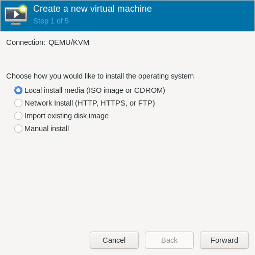
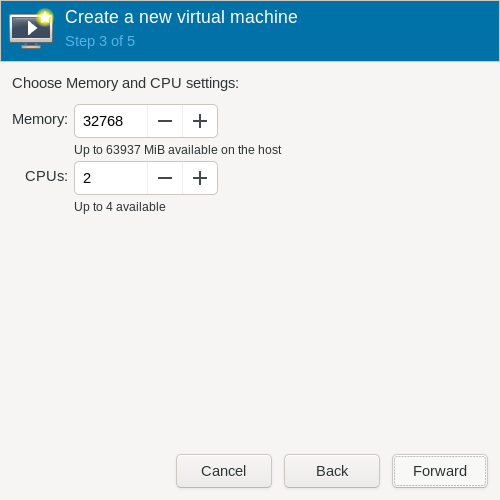
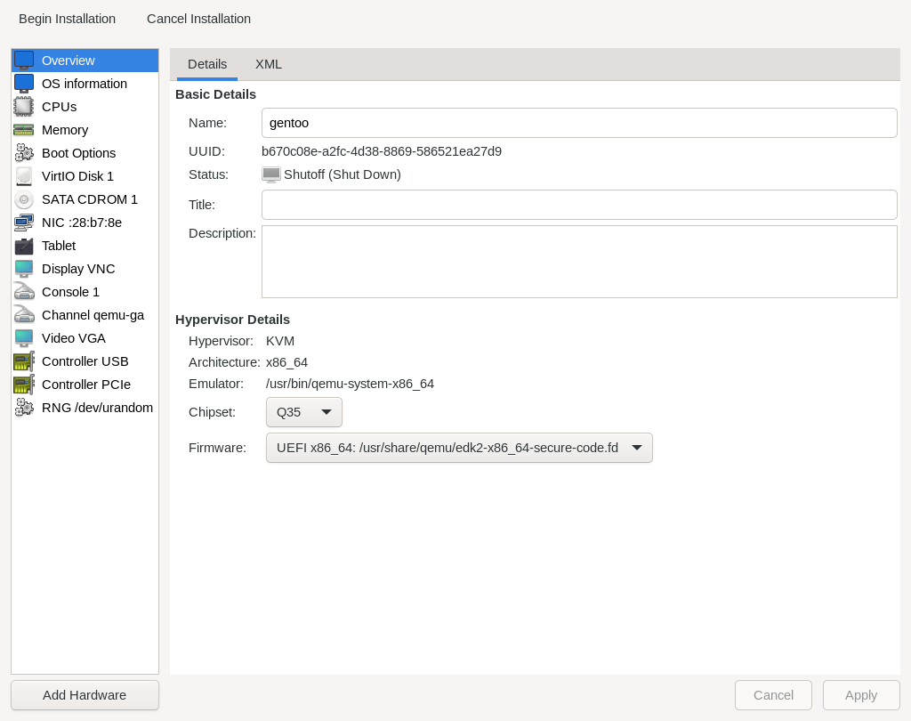
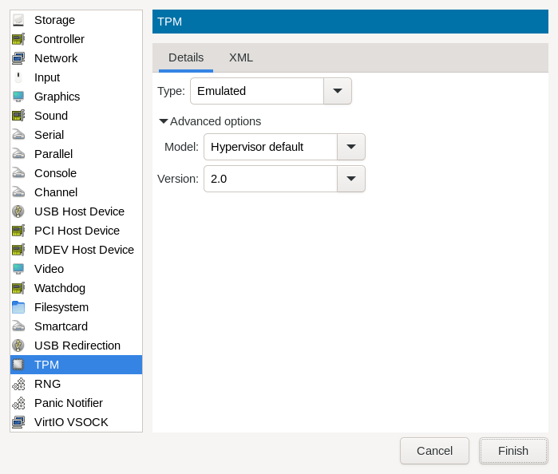
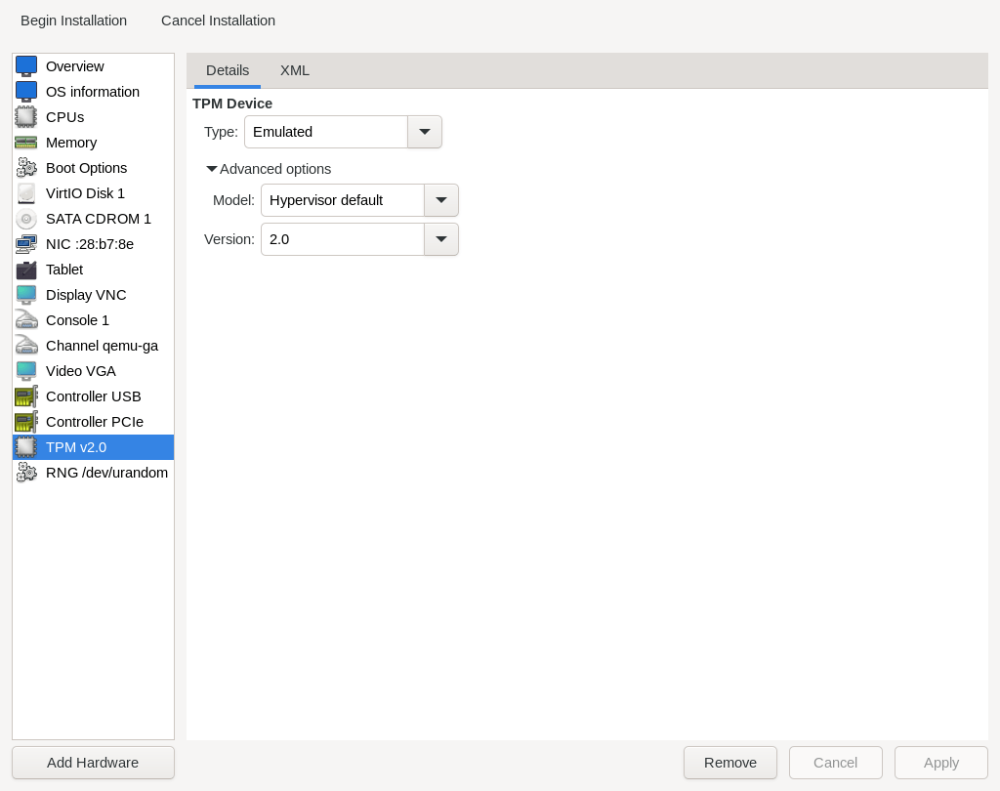

In the following, I am using [SystemRescue](https://www.system-rescue.org/), **not** the [official Gentoo Linux installation media](https://www.gentoo.org/downloads/), in order to make use of its capability to create custom installation media and setup the "rescue" partition with it's [chroot.sh script](https://github.com/duxsco/gentoo-installation/blob/main/bin/disk.sh#L223-L302). If not otherwise stated, commands are executed as "root" on the remote machine where Gentoo Linux needs to be installed, in the beginning via TTY, later on over SSH. Most of the time, you can copy&paste the whole codeblock, but understand the commands first and make adjustments (e.g. IP address, disk names) if required.

## 2.1. (Optional) Virtual (Testing) Environment

If you want to use a virtual machine for the upcoming setup either to test things out or just to be a bit more secure, you have to take some preliminary measures. The easiest way to get started is the use of the [Virtual Machine Manager](https://wiki.gentoo.org/wiki/Virt-manager) with [QEMU](https://wiki.gentoo.org/wiki/QEMU):

=== "1."
    Open the Virtual Machine Manager:

    

=== "2."
    Create a new virtual machine:

    

=== "3."
    Install from a local medium:

    

=== "4."
    Select the SystemRescue ISO and OS variant "Gentoo Linux":

    

=== "5."
    Select an appropiate amount of CPU cores and memory:

    

=== "6."
    Enable storage and select a sufficiently sized disk:

    

=== "7."
    Name your virtual machine, make sure to set the checkmark at "Customize configuration before install" and setup your network device:

    

=== "8."
    Select an UEFI x86_64 firmware with support for secure boot and click on "Add Hardware" for the next step:

    

=== "9."
    Select "TPM", configure as shown and click on "Finish":

    

=== "10."
    A new "TPM v2.0" device should be listed. Click on "Begin Installation" for the next step:

    

=== "11."
    Select an appropiate "Boot SystemRescue [...]" boot option and press ++enter++ :

    

=== "12."
    The virtual machine should have booted into SystemRescue:

    

## 2.2. Live-CD Setup

Boot into SystemRescue and [set the correct keyboard layout](https://man7.org/linux/man-pages/man1/loadkeys.1.html):

```shell
loadkeys de-latin1-nodeadkeys
```

(Optional) Start Xfce (copy&paste one command after the other):

``` { .shell .no-copy }
startx

# Open up a terminal in Xfce and set the keyboard layout:
setxkbmap de
```

Make sure you booted with UEFI:

```shell
[ -d /sys/firmware/efi ] && echo UEFI || echo BIOS
```

Disable "magic SysRq" for [security sake](https://wiki.gentoo.org/wiki/Vlock#Disable_SysRq_key):

```shell
sysctl -w kernel.sysrq=0
```

!!! info "Using screen"
    You can detach from screen's session with ++ctrl+a+d++ and reattach with `screen -d -r install`. Scrolling works with ++ctrl+a+esc++ followed by ++up++ / ++down++ / ++page-up++ / ++page-down++ . You can exit "scroll mode" with ++esc++ .

Start a [screen](https://wiki.gentoo.org/wiki/Screen) session to better cope with networks disconnects. Alternatively, you can use [tmux](https://wiki.gentoo.org/wiki/Tmux).

```shell
screen -S install
```

If no automatic network setup has been done via DHCP, you have to use [nmtui](https://www.tecmint.com/nmtui-configure-network-connection/) (recommended over [nmcli](https://linux.die.net/man/1/nmcli)). On Xfce, you have the option to use [nm-applet](https://wiki.gentoo.org/wiki/NetworkManager#GTK_GUIs) in addition.

```shell
nmtui
```

Insert an iptables rule at the correct place for SystemRescue to accept SSH connection requests:

```shell
iptables -I INPUT 4 -p tcp --dport 22 -j ACCEPT -m conntrack --ctstate NEW
```

Set a root password:

```shell
passwd root
```

Print out fingerprints to be able to double check later on upon initial SSH connection to the SystemRescue system:

```shell
find /etc/ssh/ -type f -name "ssh_host*\.pub" -exec ssh-keygen -vlf {} \;
```

Execute following "rsync" and "ssh" commands **on your local machine from within the checked out ["gentoo-installation" repo](https://github.com/duxsco/gentoo-installation/)** (copy&paste one command after the other):

``` { .shell .no-copy }
# Copy installation files to remote machine. Don't forget to set the correct IP.
rsync -e "ssh -o VisualHostKey=yes" -av --numeric-ids --chown=0:0 {bin/{portage_hook_kernel,disk.sh,fetch_files.sh,firewall.nft,firewall.sh},overlay} root@XXX:/tmp/

# From local machine, login into the remote machine
ssh root@...
```

Resume "screen":

```shell
screen -d -r install
```

(Optional) Lock the screen on the remote machine by typing the following command on its keyboard (**not over SSH**) (copy&paste one command after the other):

``` { .shell .no-copy }
# Execute "vlock" without any flags first.
vlock

# Try to relogin.

# If relogin doesn't work:
# 1. Switch TTY: <ctrl>+<alt>+<F2>
# 2. Set a correct password: passwd root
# 3. Switch to previous TTY: <ctrl>+<alt>+<F1>
# 4. Try to relogin again.

# If relogin succeeds execute vlock with flag "-a" to lock all TTY.
vlock -a
```

On bare-metal, [set the date and time](https://wiki.gentoo.org/wiki/Handbook:AMD64/Full/Installation#Setting_the_date_and_time) if the current system time is not correct:

```shell
! grep -q -w "hypervisor" <(grep "^flags[[:space:]]*:[[:space:]]*" /proc/cpuinfo) && \
# replace "MMDDhhmmYYYY" with UTC time
date --utc MMDDhhmmYYYY
```

On bare-metal, update the [hardware clock](https://wiki.gentoo.org/wiki/System_time#Hardware_clock):

```shell
! grep -q -w "hypervisor" <(grep "^flags[[:space:]]*:[[:space:]]*" /proc/cpuinfo) && \
hwclock --systohc --utc
```
